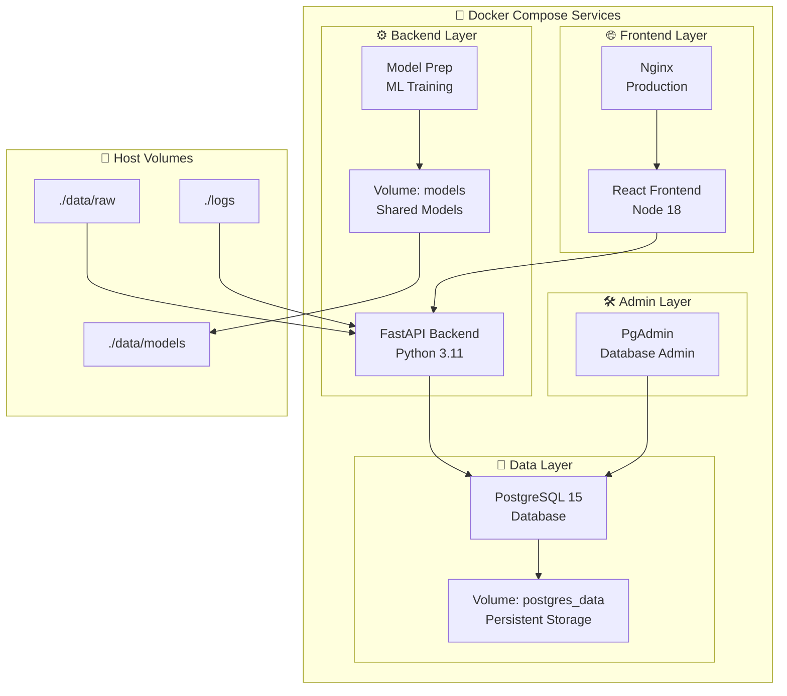

# 🐳 Docker Setup Guide - Spotify Music Recommendation System v2

**Complete Docker deployment guide for production-ready music recommendation system**

## 🎯 Overview

This guide covers containerized deployment using Docker Compose with:
- **Multi-service architecture** (PostgreSQL, FastAPI, React, PgAdmin)
- **Development and production** configurations
- **Data persistence** and volume management
- **Environment customization** and scaling
- **Health monitoring** and logging

## 🚀 Quick Start

### Prerequisites
- **Docker Desktop** 4.0+ installed and running
- **8GB+ RAM** allocated to Docker
- **20GB+ disk space** available

### One-Command Setup
```bash
# Clone and navigate
git clone <your-repo-url>
cd spotify-recommendation-system/spotify_recommendation_system_v2

# Complete setup with data import
docker-compose --profile setup up --build

# Or just start the application (after initial setup)
docker-compose up --build
```

### Access Applications
- **🌐 Frontend**: http://localhost:3000
- **🔧 API**: http://localhost:8000
- **📊 API Docs**: http://localhost:8000/docs
- **🗄️ PgAdmin**: http://localhost:5050 (admin@spotify.local / admin_password)

## 🏗️ Docker Architecture



## 📦 Service Overview

### Core Services (Always Running)
| Service | Description | Port | Purpose |
|---------|-------------|------|---------|
| `database` | PostgreSQL 15 | 5432 | Data storage and relationships |
| `backend` | FastAPI application | 8000 | API endpoints and ML services |
| `frontend` | React development | 3000 | User interface |
| `pgadmin` | Database admin | 5050 | Database management UI |

### Setup Services (Profile: setup)
| Service | Description | Purpose |
|---------|-------------|---------|
| `model-prep` | ML model training | Prepares HDBSCAN and KNN models |
| `data-import` | Database population | Imports CSV data to PostgreSQL |

## 🔧 Docker Compose Configuration

### docker-compose.yml Structure
```yaml
services:
  database:
    image: postgres:15
    environment:
      POSTGRES_DB: spotify_recommendations
      POSTGRES_USER: spotify_user
      POSTGRES_PASSWORD: ${POSTGRES_PASSWORD:-secure_password}
    volumes:
      - postgres_data:/var/lib/postgresql/data
      - ./database/init.sql:/docker-entrypoint-initdb.d/init.sql
    ports:
      - "5432:5432"
    healthcheck:
      test: ["CMD-SHELL", "pg_isready -U spotify_user"]
      interval: 30s
      timeout: 10s
      retries: 5

  backend:
    build: ./backend
    environment:
      DATABASE_URL: postgresql://spotify_user:${POSTGRES_PASSWORD:-secure_password}@database:5432/spotify_recommendations
    volumes:
      - ../data:/app/data
      - ./logs:/app/logs
    ports:
      - "8000:8000"
    depends_on:
      database:
        condition: service_healthy

  frontend:
    build: ./frontend
    environment:
      REACT_APP_API_URL: http://localhost:8000
    ports:
      - "3000:3000"
    depends_on:
      - backend

  pgadmin:
    image: dpage/pgadmin4:latest
    environment:
      PGADMIN_DEFAULT_EMAIL: admin@spotify.local
      PGADMIN_DEFAULT_PASSWORD: admin_password
    ports:
      - "5050:80"
    depends_on:
      - database

  model-prep:
    build: ./model-prep
    profiles: ["setup"]
    volumes:
      - ../data:/app/data
    depends_on:
      database:
        condition: service_healthy

volumes:
  postgres_data:
```

## 🛠️ Environment Configuration

### Environment Variables
Create a `.env` file for customization:

```bash
# Database Configuration
POSTGRES_DB=spotify_recommendations
POSTGRES_USER=spotify_user
POSTGRES_PASSWORD=your_secure_password_here

# API Configuration
API_HOST=0.0.0.0
API_PORT=8000
DEBUG=true
LOG_LEVEL=INFO

# Frontend Configuration
REACT_APP_API_URL=http://localhost:8000
REACT_APP_ENVIRONMENT=development

# PgAdmin Configuration
PGADMIN_DEFAULT_EMAIL=admin@spotify.local
PGADMIN_DEFAULT_PASSWORD=admin_password

# Performance Tuning
POSTGRES_SHARED_BUFFERS=256MB
POSTGRES_EFFECTIVE_CACHE_SIZE=1GB
POSTGRES_WORK_MEM=64MB
```

### Development vs Production
```bash
# Development environment (default)
docker-compose up --build

# Production environment
ENVIRONMENT=production docker-compose -f docker-compose.yml -f docker-compose.prod.yml up --build

# Custom environment file
docker-compose --env-file .env.production up --build
```

## 🚀 Deployment Scenarios

### 1. First-Time Setup (Complete)
```bash
# Complete setup with data import and model preparation
docker-compose --profile setup up --build

# This will:
# 1. Build all containers
# 2. Start PostgreSQL and wait for readiness
# 3. Prepare ML models
# 4. Import all CSV data
# 5. Start frontend and backend
# 6. Launch PgAdmin
```

### 2. Regular Development
```bash
# Start all services for development
docker-compose up --build

# Start in background
docker-compose up -d --build

# Start specific services
docker-compose up database backend -d
```

### 3. Production Deployment
```bash
# Production with optimized settings
ENVIRONMENT=production docker-compose up --build

# With custom configuration
docker-compose -f docker-compose.yml -f docker-compose.prod.yml up --build

# Scale services
docker-compose up --scale backend=3 --scale frontend=2
```

### 4. Development with Hot Reload
```bash
# Backend with hot reload (mount source code)
docker-compose -f docker-compose.yml -f docker-compose.dev.yml up --build

# Frontend development server
cd frontend && npm run dev
```

## 📁 Volume Management

### Persistent Volumes
```bash
# View all volumes
docker volume ls

# Inspect volume details
docker volume inspect spotify_recommendation_system_v2_postgres_data

# Backup database volume
docker run --rm -v spotify_recommendation_system_v2_postgres_data:/data -v $(pwd):/backup alpine tar czf /backup/postgres_backup.tar.gz /data

# Restore database volume
docker run --rm -v spotify_recommendation_system_v2_postgres_data:/data -v $(pwd):/backup alpine tar xzf /backup/postgres_backup.tar.gz -C /
```

### Host-Mounted Volumes
```bash
# Directory structure for volumes
spotify_recommendation_system_v2/
├── data/                    # Host volume for data
│   ├── raw/                 # CSV files (read-only in container)
│   └── models/              # ML models (read-write)
├── logs/                    # Application logs
└── database/                # Database initialization
```

## 🔍 Container Management

### Service Control
```bash
# Start all services
docker-compose up -d

# Stop all services
docker-compose down

# Restart specific service
docker-compose restart backend

# View service status
docker-compose ps

# View service logs
docker-compose logs -f backend
docker-compose logs -f database
```

### Container Inspection
```bash
# Execute commands in containers
docker-compose exec backend bash
docker-compose exec database psql -U spotify_user -d spotify_recommendations

# View container processes
docker-compose top

# Monitor resource usage
docker stats $(docker-compose ps -q)
```

### Health Monitoring
```bash
# Check service health
docker-compose ps

# Test API health
curl http://localhost:8000/health

# Test database connectivity
docker-compose exec database pg_isready -U spotify_user

# View detailed logs
docker-compose logs --tail=100 -f
```

## 🛠️ Development Workflow

### Backend Development
```bash
# Start only database for backend development
docker-compose up database -d

# Develop backend locally with hot reload
cd backend
python -m venv venv
source venv/bin/activate
pip install -r requirements.txt
uvicorn app.main:app --reload

# Or use container with volume mount
docker-compose -f docker-compose.yml -f docker-compose.dev.yml up backend
```

### Frontend Development
```bash
# Start backend services
docker-compose up database backend -d

# Develop frontend locally
cd frontend
npm install
npm run dev

# Or use container development
docker-compose up frontend
```

### Database Development
```bash
# Access database directly
docker-compose exec database psql -U spotify_user -d spotify_recommendations

# Run database migrations
docker-compose exec backend python -m app.database.migrate

# Access PgAdmin
open http://localhost:5050
```

## 🔧 Troubleshooting

### Common Issues

#### ❌ Services Won't Start
```bash
# Check Docker daemon
docker info

# Check available resources
docker system df
docker system prune -f

# View service logs
docker-compose logs database
docker-compose logs backend
```

#### ❌ Database Connection Issues
```bash
# Check database health
docker-compose exec database pg_isready -U spotify_user

# Restart database
docker-compose restart database

# Check network connectivity
docker-compose exec backend ping database
```

#### ❌ Port Conflicts
```bash
# Check what's using ports
netstat -tulpn | grep :3000
netstat -tulpn | grep :8000
netstat -tulpn | grep :5432

# Change ports in docker-compose.yml
ports:
  - "3001:3000"  # Change host port
  - "8001:8000"
```

#### ❌ Volume Permission Issues
```bash
# Fix volume permissions
sudo chown -R $USER:$USER ./data
sudo chown -R $USER:$USER ./logs

# Or use Docker user mapping
user: "${UID:-1000}:${GID:-1000}"
```

#### ❌ Memory Issues
```bash
# Increase Docker memory limit
# Docker Desktop -> Settings -> Resources -> Memory -> 8GB+

# Monitor memory usage
docker stats --no-stream

# Clean up unused containers and images
docker system prune -a
```

### Performance Optimization

#### Database Performance
```bash
# Tune PostgreSQL settings in docker-compose.yml
environment:
  - POSTGRES_SHARED_BUFFERS=512MB
  - POSTGRES_EFFECTIVE_CACHE_SIZE=2GB
  - POSTGRES_WORK_MEM=128MB
  - POSTGRES_MAINTENANCE_WORK_MEM=256MB
  - POSTGRES_MAX_CONNECTIONS=200
```

#### Application Performance
```bash
# Scale backend services
docker-compose up --scale backend=3

# Use production builds
ENVIRONMENT=production docker-compose up --build

# Enable caching
environment:
  - REDIS_URL=redis://redis:6379
```

## 📊 Monitoring and Logging

### Log Management
```bash
# View logs from all services
docker-compose logs -f

# View logs from specific timeframe
docker-compose logs --since="2024-01-01T00:00:00Z" --until="2024-01-01T23:59:59Z"

# Configure log rotation in docker-compose.yml
logging:
  driver: "json-file"
  options:
    max-size: "100m"
    max-file: "3"
```

### Health Checks
```bash
# Add health checks to services
healthcheck:
  test: ["CMD", "curl", "-f", "http://localhost:8000/health"]
  interval: 30s
  timeout: 10s
  retries: 3
  start_period: 40s
```

### Monitoring Stack (Optional)
```yaml
# Add to docker-compose.yml for monitoring
services:
  prometheus:
    image: prom/prometheus
    ports:
      - "9090:9090"
    volumes:
      - ./monitoring/prometheus.yml:/etc/prometheus/prometheus.yml

  grafana:
    image: grafana/grafana
    ports:
      - "3001:3000"
    environment:
      - GF_SECURITY_ADMIN_PASSWORD=admin
```

## 🚀 Production Deployment

### Production Configuration
```yaml
# docker-compose.prod.yml
services:
  backend:
    environment:
      - DEBUG=false
      - LOG_LEVEL=WARNING
    restart: unless-stopped

  frontend:
    build:
      context: ./frontend
      dockerfile: Dockerfile.prod
    restart: unless-stopped

  database:
    environment:
      - POSTGRES_SHARED_BUFFERS=1GB
      - POSTGRES_EFFECTIVE_CACHE_SIZE=4GB
    restart: unless-stopped
```

### SSL and Security
```bash
# Add SSL termination with nginx
services:
  nginx:
    image: nginx:alpine
    ports:
      - "443:443"
      - "80:80"
    volumes:
      - ./nginx/nginx.conf:/etc/nginx/nginx.conf
      - ./ssl:/etc/ssl/certs
    depends_on:
      - frontend
      - backend
```

### Backup Strategy
```bash
# Automated backup script
#!/bin/bash
DATE=$(date +%Y%m%d_%H%M%S)
docker-compose exec -T database pg_dump -U spotify_user spotify_recommendations > "backup_${DATE}.sql"
```

## 🤝 Best Practices

### Security
- Use strong passwords in `.env` file
- Keep `.env` file out of version control
- Use Docker secrets for production
- Regular security updates: `docker-compose pull`

### Performance
- Allocate adequate resources to Docker
- Use multi-stage builds for smaller images
- Implement proper caching strategies
- Monitor resource usage regularly

### Maintenance
- Regular backups of database and models
- Log rotation and cleanup
- Update base images periodically
- Monitor disk space usage

---

**🐳 Happy Containerized Deployment!** 🐳 