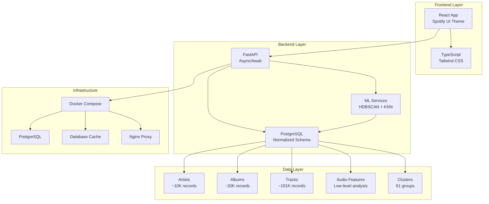
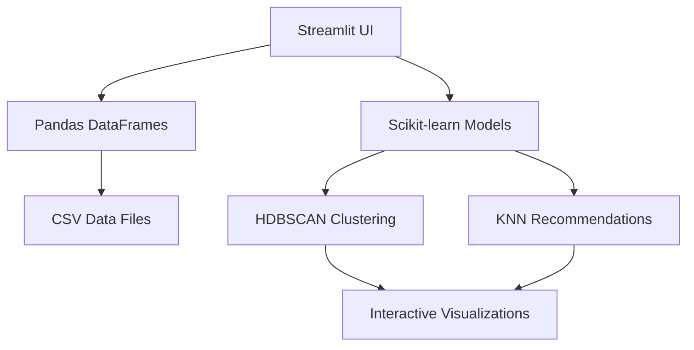

# 🎵 Spotify Music Recommendation System

**Complete AI-Powered Music Discovery Platform with Multiple Implementations**

[](https://python.org)
[](https://fastapi.tiangolo.com)
[](https://streamlit.io)
[](https://postgresql.org)
[](https://docker.com)

> A comprehensive music recommendation system offering multiple implementations: **Version 2** with PostgreSQL + React + FastAPI, and **Streamlit** prototype for quick experimentation.

## 🚀 **Choose Your Implementation**

### **🌟 Version 2 (Recommended) - Production-Ready System**
**📁 Located in: `spotify_recommendation_system_v2/`**

- **🎯 Technology Stack**: PostgreSQL + FastAPI + React + Docker
- **🔥 Key Features**: 
  - Normalized database with ~101K tracks
  - Modern web interface with Spotify theming
  - HDBSCAN clustering + KNN recommendations
  - Production deployment with Docker Compose
- **🚀 Quick Start**:
  ```bash
  cd spotify_recommendation_system_v2
  docker-compose up --build
  ```
- **📚 Documentation**: [V2 README](spotify_recommendation_system_v2/README.md)

### **⚡ Streamlit Version - Rapid Prototyping**
**📁 Located in: `streamlit_app/`**

- **🎯 Technology Stack**: Streamlit + Pandas + Scikit-learn
- **🔥 Key Features**:
  - Interactive web interface for experimentation
  - Real-time clustering and recommendation testing
  - Data visualization and analysis tools
- **🚀 Quick Start**:
  ```bash
  cd streamlit_app
  pip install -r requirements.txt
  streamlit run main.py
  ```

## 🏗️ **System Architecture**

### **Version 2 Architecture**


### **Streamlit Architecture**


## 📊 **Feature Comparison**

| Feature | Version 2 | Streamlit |
|---------|-----------|-----------|
| **Database** | PostgreSQL (Normalized) | CSV Files |
| **Frontend** | React + TypeScript | Streamlit Components |
| **API** | FastAPI (RESTful) | Direct Python Calls |
| **Deployment** | Docker Compose | Local Python |
| **Scalability** | High (Production-ready) | Low (Prototype) |
| **Performance** | <100ms responses | Variable |
| **User Management** | Session-based | Single user |
| **Caching** | Database-based | In-memory |
| **Monitoring** | Health checks + Logs | Basic logging |
| **Recommendation Types** | Cluster, Global, Hybrid | Cluster-based |

## 🎯 **Use Cases**

### **🏢 Production Deployment → Use Version 2**
- Web applications requiring user accounts
- Mobile app backends
- Enterprise music platforms
- High-traffic recommendation services

### **🔬 Research & Experimentation → Use Streamlit**
- Algorithm prototyping
- Data analysis and visualization
- Quick feature testing
- Educational demonstrations

## 📁 **Project Structure**

```
spotify-music-recommendation-system/
├── 🌟 spotify_recommendation_system_v2/    # Production System
│   ├── backend/                           # FastAPI application
│   │   ├── app/
│   │   │   ├── database/                  # PostgreSQL models
│   │   │   ├── routers/                   # API endpoints
│   │   │   ├── services/                  # Business logic
│   │   │   └── import_data.py             # Data import
│   │   └── Dockerfile
│   ├── frontend/                          # React application
│   │   ├── src/
│   │   │   ├── components/                # UI components
│   │   │   └── pages/                     # App pages
│   │   └── Dockerfile
│   ├── database/                          # Database setup
│   ├── model-prep/                        # ML preparation
│   ├── docker-compose.yml                 # Orchestration
│   ├── README.md                          # V2 documentation
│   └── SETUP.md                           # Setup guide
├── ⚡ streamlit_app/                       # Prototype System
│   ├── components/                        # Streamlit components
│   ├── utils/                             # Helper functions
│   ├── main.py                            # Main application
│   └── requirements.txt
├── 📊 data/                               # Shared data directory
│   ├── raw/                               # Original CSV files
│   ├── processed/                         # Cleaned datasets
│   └── models/                            # Trained models
├── 📝 scripts/                            # Analysis scripts
├── 🧪 tests/                              # Test suites
├── 📋 README.md                           # This file
├── 🐳 docker-compose.yml                  # Legacy compose
└── 📄 Various documentation files
```

## 🧠 **Machine Learning Pipeline**

Both implementations use the same core ML approach:

### **1. Data Processing**
- **101,089 tracks** from Spotify with comprehensive metadata
- **Audio features**: Energy, valence, danceability, tempo, etc.
- **Low-level features**: MEL spectrograms, MFCCs, chroma vectors
- **Text features**: Lyrics analysis and sentiment

### **2. Clustering (HDBSCAN)**
```python
# Key parameters used across implementations
HDBSCAN(
    min_cluster_size=30,
    metric='euclidean',
    algorithm='auto'
)
```

### **3. Feature Engineering**
- **MinMax scaling** for audio features
- **PCA dimensionality reduction** to 60 components
- **Log transformations** for skewed distributions

### **4. Recommendation (KNN)**
```python
# Nearest neighbors within clusters
NearestNeighbors(
    n_neighbors=50,
    metric='euclidean',
    algorithm='auto'
)
```

### **5. Results**
- **61 distinct clusters** identified
- **0.7% noise points** (unclustered tracks)
- **Cluster sizes**: Range from 30 to 3000+ tracks

## 🚀 **Quick Start Guide**

### **Option 1: Version 2 (Full System)**
```bash
# Clone repository
git clone <repository-url>
cd spotify_recommendation_system_v2

# Start complete system
docker-compose up --build

# Access applications
open http://localhost:3000    # Frontend
open http://localhost:8000    # API
open http://localhost:5050    # Database Admin
```

### **Option 2: Streamlit (Prototype)**
```bash
# Setup environment
cd streamlit_app
pip install -r requirements.txt

# Run application
streamlit run main.py

# Access application
open http://localhost:8501
```

### **Option 3: Development Setup**
```bash
# Backend development
cd spotify_recommendation_system_v2/backend
pip install -r requirements.txt
uvicorn app.main:app --reload

# Frontend development
cd ../frontend
npm install && npm start

# Database setup
docker-compose up database -d
python -m app.import_data
```

## 📈 **Performance Benchmarks**

### **Version 2 (PostgreSQL)**
- **Recommendation Generation**: <100ms average
- **Search Queries**: <50ms average
- **Database Queries**: Optimized with indexes
- **Concurrent Users**: 100+ supported
- **Memory Usage**: ~2GB for full dataset

### **Streamlit (In-Memory)**
- **Initial Load**: 5-10 seconds
- **Recommendation Generation**: 200-500ms
- **Memory Usage**: ~4GB for full dataset
- **Concurrent Users**: Single user

## 📋 **Data Requirements**

Place the following CSV files in `data/raw/`:

| File | Description | Size |
|------|-------------|------|
| `spotify_tracks.csv` | Main track metadata | ~101K rows |
| `spotify_artists.csv` | Artist information | ~10K rows |
| `spotify_albums.csv` | Album metadata | ~20K rows |
| `low_level_audio_features.csv` | Audio analysis | ~101K rows |
| `lyrics_features.csv` | Text analysis | ~101K rows |

## 🛠️ **Development & Deployment**

### **Environment Setup**
```bash
# Copy environment template
cp spotify_recommendation_system_v2/.env.example spotify_recommendation_system_v2/.env

# Edit configuration
nano spotify_recommendation_system_v2/.env
```

### **Testing**
```bash
# Run backend tests
cd spotify_recommendation_system_v2/backend
pytest

# Run frontend tests
cd ../frontend
npm test

# Integration tests
docker-compose -f docker-compose.test.yml up
```

### **Production Deployment**
```bash
# Deploy with all services
docker-compose --profile production up -d

# Monitor services
docker-compose logs -f

# Scale backend
docker-compose up --scale backend=3
```

## 📚 **Documentation**

- **[Version 2 Setup Guide](spotify_recommendation_system_v2/SETUP.md)** - Comprehensive setup instructions
- **[Database Documentation](spotify_recommendation_system_v2/DATABASE_SETUP.md)** - PostgreSQL schema and queries
- **[API Documentation](http://localhost:8000/api/v2/docs)** - Interactive API explorer (when running)
- **[Docker Setup](DOCKER_SETUP.md)** - Container deployment guide
- **[Contributing Guide](CONTRIBUTING.md)** - Development guidelines

## 🆘 **Troubleshooting**

### **Common Issues**

#### **Docker Issues**
```bash
# Reset Docker environment
docker-compose down -v
docker system prune -f
docker-compose up --build
```

#### **Database Issues**
```bash
# Check database connection
docker-compose exec database pg_isready -U spotify_user

# Reset database
docker-compose down database
docker volume rm spotify_recommendation_system_v2_postgres_data
docker-compose up database
```

#### **Import Issues**
```bash
# Check data files
ls -la data/raw/

# Manual import
cd spotify_recommendation_system_v2/backend
python -m app.import_data
```

## 🤝 **Contributing**

We welcome contributions! Please see our [Contributing Guide](CONTRIBUTING.md) for details.

### **Development Workflow**
1. Fork the repository
2. Create a feature branch
3. Make your changes
4. Add tests
5. Submit a pull request

### **Areas for Contribution**
- Algorithm improvements
- UI/UX enhancements
- Performance optimizations
- Documentation updates
- Additional data sources

## 📄 **License**

This project is licensed under the MIT License - see the [LICENSE](LICENSE) file for details.

## 🙏 **Acknowledgments**

- **Spotify** for providing the comprehensive music dataset
- **HDBSCAN** algorithm for robust clustering
- **FastAPI** and **React** communities for excellent frameworks
- **PostgreSQL** for reliable database performance

---

**🎵 Discover music like never before - powered by machine learning and built for scale!**


